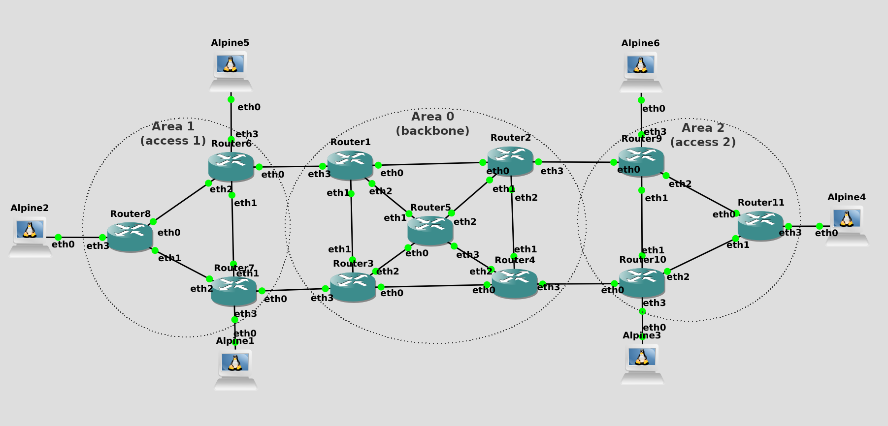

# Docker FRR

The project comprises 11 FRR routers based on the **harmonia_frr** Docker image, which should be built before importing the project in GNS3. It also includes four Alpine containers for the hosts and two controllers based on **harmonia_controller** Docker image, which builds the [ROSE SRv6 Control Plane](https://github.com/netgroup/rose-srv6-control-plane) inside a Debian 10 container.

## Building router image - harmonia_frr

In this version, the controller functionality is embedded into routers. 

    docker build routers/ -t harmonia_frr

## Building hosts image - harmonia_hosts

Hosts can be built with the following command:

    docker build hosts/ -t harmonia_hosts

## Open the project in GNS3

This repository contains a GNS3 project in file **11r-ft.gns3project**. It can be imported in GNS3 GUI in menu File -> "Import Portable Project".

## Running

### PCEC software

The default PCEC can be changed in `routers/src/config.py`, variable `CONTROLLER_ADDRESS`. By default, it is defined to be Router 6. Once configured, a terminal can be opened for the selected PCEC. Then, the software for PCEC can be executed by typing the following command:

    python3 src/pcec.py

This software is responsible for collecting data from different routers and apllying SRv6 policies in order to avoid congested paths.

### PCC software

The PCC software can be executed in every router by typing the following command:

    python3 src/pcc.py

## Code examples

Code examples provide basic functionality in the controller. Examples are written in Python and are available at folder `/src/examples`.

### SRv6 path

An example of SRv6 is available at `routers/src/examples/sr_example.py`. In such an example, a code is provided to encapsulate an SRv6 path from R7 to R8, passing through R6. The provided code uses the ROSE SRv6 controller libraries to insert SR paths in the routers.

