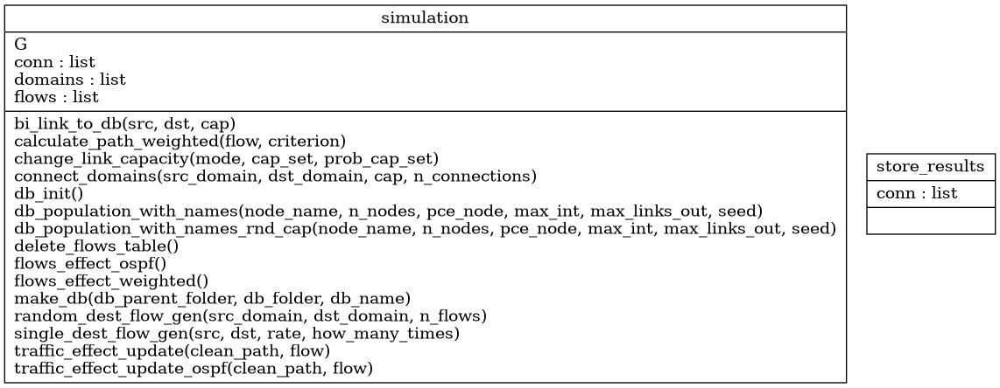
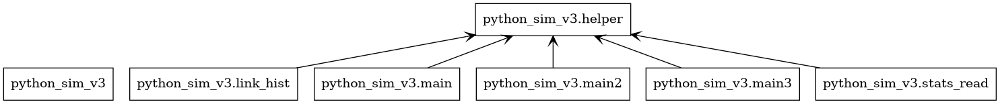

# Simulation

## Documentation

Code diagrams (classes and packages) can be generated automatically with Pyreverse. 

    pyreverse -o png -p Simulation python_sim_v3/

Class Diagram:

Packages Diagram:

